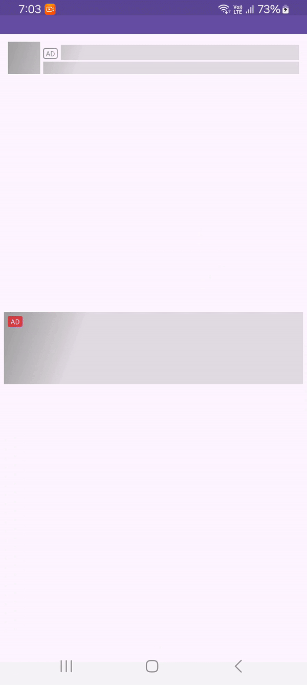
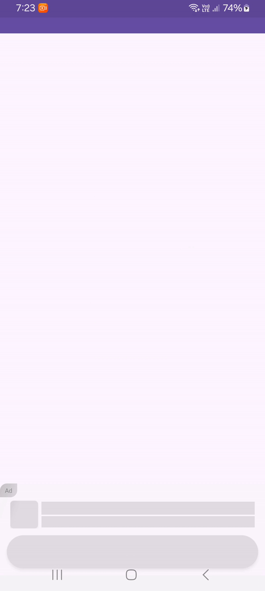
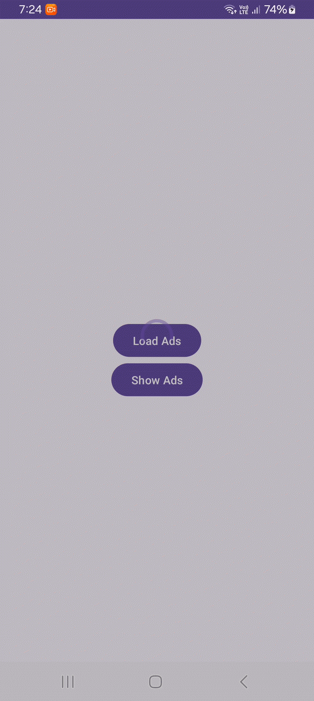
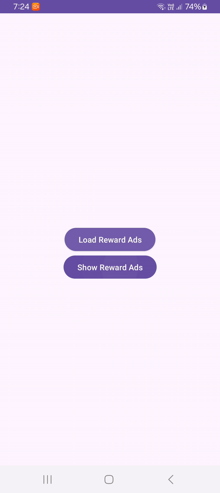
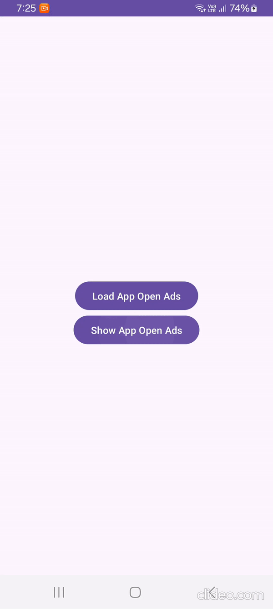

# GoogleAdsManager
Explore to our Google Ad Library on GitHub – your go-to resource for seamless integration and effortless development. Dive in, explore, and leverage the power of our user-friendly tools to enhance your projects with ease.

# Demo

## Ad view Layout
|        Banner Ads Layouts     |        Native Ads Layouts     |      
| ---------------------------- | ----------------------------- | 
|  |  |

## Fullscreen Ad Layout
|        Interstitial Ads     |        Rewarded Ads     | AppOpen Ads |     
| ---------------------------- | ----------------------------- | ---------- |
|  |  |  |

# Download
To include library in your project, add the following to your dependencies:

> Step 1. Add the JitPack repository to your build file

```gradle
dependencyResolutionManagement {
		repositoriesMode.set(RepositoriesMode.FAIL_ON_PROJECT_REPOS)
		repositories {
			mavenCentral()
			maven { url 'https://jitpack.io' }
		}
	}
```
> Step 2. Add the dependency
```gradle
dependencies {
          implementation 'com.github.NaimishTrivedi:GoogleAdsManager:1.0.1'
          implementation 'com.facebook.shimmer:shimmer:0.5.0'
          implementation 'com.google.firebase:firebase-analytics:21.5.1'
          implementation 'com.google.android.gms:play-services-ads:22.6.0'
	}
```
> Step 3. App Mainfest file
```AndroidMainfest.xml
<manifest>
    <!-- If app run in android 13 this permission needed -->
    <uses-permission android:name="com.google.android.gms.permission.AD_ID" />

    <application>
           <meta-data
              android:name="com.google.android.gms.ads.AD_MANAGER_APP"
              android:value="true" />
          <!-- Sample AdMob App ID: ca-app-pub-3940256099942544~3347511713 -->
          <meta-data
              android:name="com.google.android.gms.ads.APPLICATION_ID"
              android:value="ca-app-pub-3940256099942544~3347511713" />
    </application>
</manifest>
```
Build project and yuppp go on!!!

# Usage

Read following documantation for integrate all types of google ads in app.

## Banner Ads

The following snippet shows how you can use Banner Ads in your project.

**Layout**
```layout.xml
<naimishtrivedi.in.googleadsmanager.BannerAds
        android:id="@+id/mBannerAds"
        android:layout_width="match_parent"
        android:layout_height="wrap_content"/>
```

**Activity**
```activity
public class MainActivity extends AppCompatActivity{

    private BannerAds mBannerAds;

    @Override
    protected void onCreate(Bundle savedInstanceState){
        super.onCreate(savedInstanceState);
        setContentView(R.layout.main_activity);

        mBannerAds = findViewById(R.id.mBannerAds);

        //We can listing ads callback using setOnAdsViewListener
        mBannerAds.setOnAdsViewListener(new OnAdsViewListener() {
            @Override
            public void onAdsSuccess(String adResource) {
                Log.e("TAG",adResource+" Success");
            }

            @Override
            public void onAdsFailure(String adResource,String errorMsg) {
                Log.e("TAG",adResource+" Error msg "+errorMsg);
            }
        });

        //show ads using below method
         mBannerAds.showAds("/6499/example/banner");
    }

}
```
**Available XML attributes**

| Attribute name | Format | Description |
| --- | --- | --- |
| layout_animation | reference | Layout reference used for as shimmer base. |
| showAnimation | boolean | When set to "false" shimmer animation is not shown, "true" by default. |
| adsBannerSize | enum | defaultSize and largeSize values available for define banner ads size. |

## Native Ads
The following snippet shows how you can use Native Ads in your project.

**Layout**
```layout.xml
<naimishtrivedi.in.googleadsmanager.NativeBannerAds
        android:id="@+id/mNativeAds"
        android:layout_width="match_parent"
        android:layout_height="wrap_content"/>
```

**Activity**
```activity
public class MainActivity extends AppCompatActivity{

    private NativeBannerAds mNativeAds;

    @Override
    protected void onCreate(Bundle savedInstanceState){
        super.onCreate(savedInstanceState);
        setContentView(R.layout.main_activity);

        mNativeAds = findViewById(R.id.mNativeAds);

        //We can listing ads callback using setOnAdsViewListener
        mNativeAds.setOnAdsViewListener(new OnAdsViewListener() {
            @Override
            public void onAdsSuccess(String adResource) {
                Log.e("TAG",adResource+" Success");
            }

            @Override
            public void onAdsFailure(String adResource,String errorMsg) {
                Log.e("TAG",adResource+" Error msg "+errorMsg);
            }
        });

        //show ads using below method
         mNativeAds.showAds("/6499/example/native");
    }

}
```
**Available XML attributes**

| Attribute name | Format | Description |
| --- | --- | --- |
| layout_animation | reference | Layout reference used for as shimmer base. |
| showAnimation | boolean | When set to "false" shimmer animation is not shown, "true" by default. |
| adsLayoutId | reference | Layout reference used for as native ad show. |

## Interstitial Ads
The following snippet shows how you can use Interstitial Ads in your project.

**Activity**
```activity
public class MainActivity extends AppCompatActivity implements OnAdsListener{

    private InterstitialAds mInterstitialAds;

    @Override
    protected void onCreate(Bundle savedInstanceState){
        super.onCreate(savedInstanceState);
        setContentView(R.layout.main_activity);

        mInterstitialAds = new InterstitialAds("/6499/example/interstitial",this);

        //add ads callback listener
         mInterstitialAds.setOnAdsListener(this);

        //load ads using below method
         mInterstitialAds.loadAd();
    }

     @Override
    public void onAdLoaded() {
         //show ads using below method
        if(mInterstitialAds.isAdsReady()){
            mInterstitialAds.showAd();
        }
    }

    @Override
    public void onAdLoadFailed(String adsId, String error) {
       
    }

    @Override
    public void onAdFailedToShow(String error) {
    
    }

    @Override
    public void onAdShowed() {
      
    }

    @Override
    public void onAdClicked() {
       
    }

    @Override
    public void onAdDismiss() {
        
    }
}
```
## Reward Ads
The following snippet shows how you can use Reward Ads in your project.

**Activity**
```activity
public class MainActivity extends AppCompatActivity implements OnRewardAdsListener{

    private RewardAds mRewardAds;

    @Override
    protected void onCreate(Bundle savedInstanceState){
        super.onCreate(savedInstanceState);
        setContentView(R.layout.main_activity);

        mRewardAds = new RewardAds("/6499/example/rewarded", this);

        //add ads callback listener
         mRewardAds.setOnRewardAdsListener(this);

        //load ads using below method
         mRewardAds.loadAd();
    }

     @Override
    public void onAdLoaded() {
         //show ads using below method
        if(mRewardAds.isAdsReady()){
            mRewardAds.showAd();
        }
    }

    @Override
    public void onAdLoadFailed(String adsId, String error) {
       
    }

    @Override
    public void onAdFailedToShow(String error) {
    
    }

    @Override
    public void onAdShowed() {
      
    }

    @Override
    public void onAdClicked() {
       
    }

    @Override
    public void onAdDismiss() {
        
    }

     @Override
    public void onUserRewarded(RewardEarned rewardEarned) {
     
    }
}
```
## AppOpen Ads
The following snippet shows how you can use AppOpen Ads in your project.

**Activity**
```activity
public class MainActivity extends AppCompatActivity implements OnAdsListener{

    private AppOpenAds mAppOpenAds;

    @Override
    protected void onCreate(Bundle savedInstanceState){
        super.onCreate(savedInstanceState);
        setContentView(R.layout.main_activity);

         mAppOpenAds = new AppOpenAds("/6499/example/app-open",this);

        //add ads callback listener
         mAppOpenAds.setOnAdsListener(this);

        //load ads using below method
         mAppOpenAds.loadAd();
    }

     @Override
    public void onAdLoaded() {
         //show ads using below method
        if(mAppOpenAds.isAdsReady()){
            mAppOpenAds.showAd();
        }
    }

    @Override
    public void onAdLoadFailed(String adsId, String error) {
       
    }

    @Override
    public void onAdFailedToShow(String error) {
    
    }

    @Override
    public void onAdShowed() {
      
    }

    @Override
    public void onAdClicked() {
       
    }

    @Override
    public void onAdDismiss() {
        
    }
}
```

# OnAdRevenueListener

## Usage
Available inbuilt **OnAdRevenueListener** for track our Ad revenue in any types of ads.

For Example :
```
    mBannerAds.setOnAdRevenueListener(new OnAdRevenueListener() {
        @Override
        public void onPaidEvent(AdsPaidModel model) {
              
        }
    });
```
